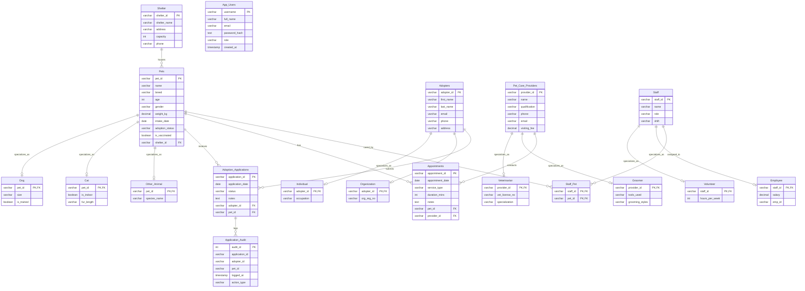

# Pet Adoption and Care System - EER Diagram

This file provides the EER model for the project database used in `setup.sql`.

Presentation style version (for screenshot/export):
- `docs/EER_Diagram_Presentation.html`

## Specialization Constraints (EER Notes)

- `Pets -> Dog/Cat/Other_Animal`: treated as disjoint in app workflow.
- `Adopters -> Individual/Organization`: overlapping allowed (one adopter may appear in both).
- `Pet_Care_Providers -> Veterinarian/Groomer`: disjoint specialization.
- `Staff -> Volunteer/Employee`: disjoint specialization.

## Mapping to SQL

All entities, keys, and relationships above are implemented in `setup.sql` using primary keys, foreign keys, junction tables, triggers, and views.